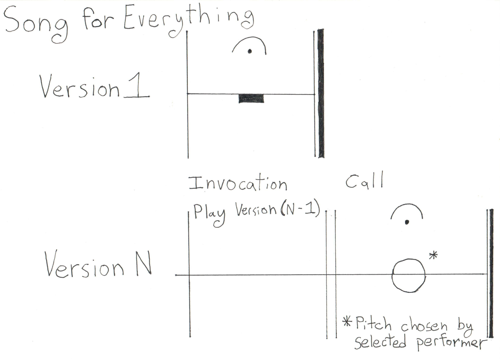

# Song For Everything

## Dedication

This song is dedicated to everything that was, is, and will be.

## Score

_Please excuse the sloppiness of this handwritten score. I intend to provide a neater version in the 
 future._

## Performance instructions

This song is a series of notes, starting with silence, evolving a message that is dedicated to everything that was, is, and will be. It is an ongoing work by people and for people, in community, listening together.
    
### The essence

* _A series of notes:_ The song is a series of notes, chosen by the performers and performed in unison, to the best of their ability.
* _Starting with silence:_ The first note of the song is a moment of silence.   
* _Evolving:_ Each performance of the song creates a new version of it. For each performance the performers select a version of the song to perform and one performer to compose a single "new" note for the performance.
* _A message:_ The performance has two parts:
  * **Invocation**: The ensemble plays the notes of their chosen song version in the order they were previously performed. 
  * **Call**: A selected performer plays their chosen note, and the rest of the ensemble then plays the same note with them for the remainder of the performance. 

### At each performance

* _By people:_ The performing ensemble must have at least two members and all performers must be persons.
* _For people:_ The performers and audience must be located in the same place and time during the performance. 
* _In community:_ The audience must include at least one person who requested the performers to perform the song 
  at that time and place, and who attends the entire performance.
* _Listening together:_ The performance must last at least 30 minutes. 

## Recommendations

While your performance is up to you, here are some recommendations that might help you in planning your performance.

### "New" note performer selection

The recommended means for selecting the performer who plays the "new" notes is as follows.

1. Identify the performer(s) who have least recently contributed a note to the chosen version of the song.
2. Of those performers, choose the one for whom the next opportunity to contribute to this version of the song, if not selected now, will be furthest in the future. 

If that method is problematic, try selecting a performer at random, using the random number generator of your choice (coin, dice, computer, etc.)  

### Recording

Try to record information about each performance, especially who played what note, the time and location of the performance, and the song version performed. Ideally, record the audio/video and share it with the world.
  
## Explanations/Elaborations/Notes

* The simplest version of the song is a moment of silence.
* For example, some versions of the song might include [silence], [silence, A4, G4], and [silence, C5, C5, C5, F4].1
* Motivations: Here are some of the questions I'm trying to answer through this composition.
  * Can you create a piece of performance music...
     * As a simple song that anyone can perform?
     * That has a melody of arbitrary complexity?
     * That bears repeating over a very long period of time?
     * That is very abstract while having an uplifting aspect?
     * That conceivably could last the duration of the universe?
     * The reflects the complexity of biological evolution and illuminates the question "how is a song like DNA and biological processes"?
     * That allows the performers to be most fully engaged with their collective expression with the minimum of distraction -- creating an uplifting experience for the musicians themselves?
     * That is also suitable for "warming up", "practice", or "musical meditation"?
* Minimum duration: The piece has a minimum duration of 30 minutes in an attempt to strike a balance between the desire to assure that the performance gives enough time for the performers and audience to attain a reflective state, while allowing the performance to be short enough for non-professional musicians to comfortably perform it.
* Instrumentation
  * Play whatever instruments you want, including the voice. As long as you can play the notes to the best of your ability on the instrument, go for it. 
  * It is considered poor form to play a "new" note that is not possible to be played by another member of the ensemble. 
  * It is fine for performers to play multiple instruments. One case for this is where one instrument can't play all of the notes, and a secondary instrument is used to play the notes that can't be played on the first. 
  * Some instruments, i.e. wind instruments and the voice, won't be able to produce tones of very long durations that may be required. Just do your best to keep the tone going using whatever technique is available to you. I.e. that might mean taking short breaths and then attacking the note again, repeatedly. 

## Status

This composition is a draft. Constructive comments and suggestions are welcome (see below). 

## TODO

* This page is long and should be refactored.
* Encode the score using software like MuseScore. 2
* "In community" -- is that good english? Does it make sense?

## Contact

Please contact [Matt Munz](https://github.com/mattmunz) to provide constructive feedback (which would be very welcome). 
Information about performances of this work would be really appreciated. 

## Author

[Matt Munz](https://github.com/mattmunz)

-------------------------

1) [Wikipedia: Scientific pitch notation](https://en.wikipedia.org/wiki/Scientific_pitch_notation)
2) [MuseScore](https://musescore.org)

